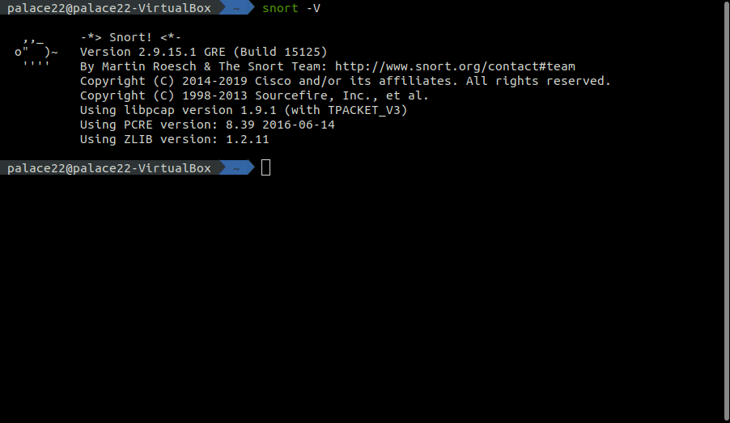
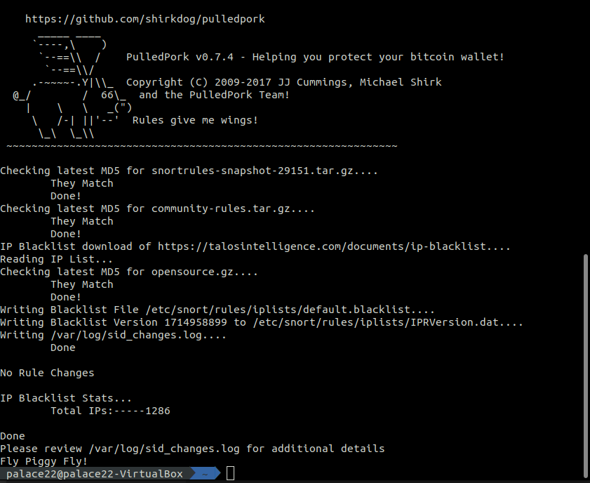
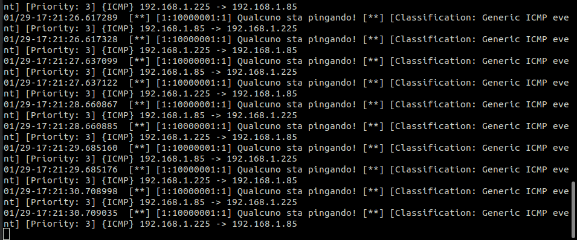

# Snort
[](https://www.html.it/pag/69358/installazione-4/)

Snort è *"an open source intrusion prevention system capable of real-time traffic analysis and packet logging"*. Dunque non è solo un IDS ma permette anche di prevenire gli attacchi, esso ha quattro livelli di sicurezza: 
1. Sniffer: cattura i pacchetti
2. Packet logger: legge i pacchetti catturati
3. IDS: monitora e analizza i pacchetti e in caso di pacchetti sospetti notifica l'intrusione
4. IPS: tenta di difendere il sistema dall'attacco


## Installazione 
Andremo a installare l'ultima versione di **Snort**, la **2.9.15.1** su una VM *Ubuntu 19.10*.

Installiamo prima di tutto il pacchetto *Data Acquisition library*, introdotto dalla versione 2.9, volto a creare un livello di astrazione rispetto a chiamate dirette alle funzioni *libpcap* ( libreria che fornisce funzioni per catturare pacchetti ).

Fatto ciò possiamo passare all'installazione vera e propria riportata in *InstallSnort*.



## Regole Snort
Esistono tre modalità per istanziare nuove regole:
1. Download delle [regole ufficiali](https://www.snort.org/advisories/talos-rules-2020-01-22)
2. Download delle [regole della community](https://www.snort.org/downloads/community/community-rules.tar.gz) 
3. Creazione manuale

Le regole devono essere scritte in maniera accurata e possibilmente devono avere un obbiettivo specifico per non sovraccaricare la rete, inoltre bisognerebbe aggiornarle spesso.

Uno strumento molto efficace che ci viene in aiuto è **PulledPork**: script perl che scarica e setta su Snort tutte le regole della Community; utile è un cronjob da attivare per scaricarle periodicamente.




## Test
Proviamo a scrivere una semplice regola di rilevazione di ping e testarne il funzionamento. Abbiungiamo la regola all'interno del file *local.rules*:

```
alert icmp any any -> $HOME_NET any (msg:"Qualcuno sta pingando!"; GID:1; sid:10000001; rev:001; classtype:icmp-event;)
```
ed eseguiamo l'update di Snort, sarà visualizzato un messaggio di "nuova regola". Dunque dall'host avviamo il ping sull'IP della VM e vediamo il risultato:




## Conclusioni
I vantaggi di Snort sono:

1. L'admin può sviluppare facilemnte nuove regole per rilevare nuovi attacchi
2. Ha una community molto ampia che fornisce regole sempre aggiornate
3. Ha una struttura modulare
4. Il progetto è open source

Gli svantaggi sono:

1.      non tratta bene la deframmentazione IP.

2.      mancanza di livelli per gli alert.

3.      tutti quelli comuni agli IDS basati sul pattern matching.

 