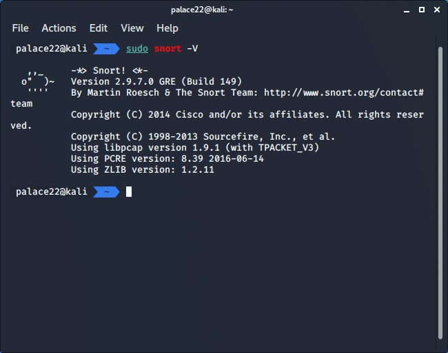
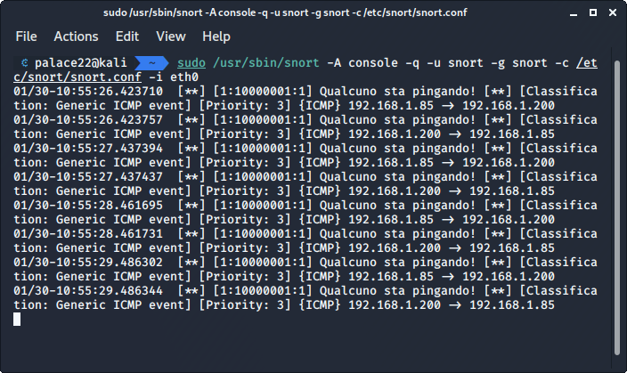
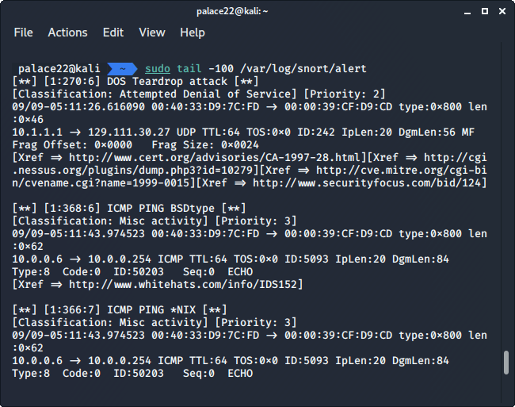

# Snort

Snort è *"an open source intrusion prevention system capable of real-time traffic analysis and packet logging"*, implementato da Matt Roesch nel 1998. Dunque non è solo un IDS ma permette anche di prevenire gli attacchi, esso ha quattro livelli di sicurezza: 
1. Sniffer: cattura i pacchetti
2. Packet logger: legge i pacchetti catturati
3. IDS: monitora e analizza i pacchetti e in caso di pacchetti sospetti notifica l'intrusione
4. IPS: tenta di difendere il sistema dall'attacco


## Installazione 
Andremo a installare **Snort** versione **2.9.7.0** su una VM *Kali Linux*.

Installiamo prima di tutto il pacchetto *Data Acquisition library*, introdotto dalla versione 2.9, volto a creare un livello di astrazione rispetto a chiamate dirette alle funzioni *libpcap* ( libreria che fornisce funzioni per catturare pacchetti ).

Fatto ciò possiamo passare all'installazione vera e propria riportata in *InstallSnort*.

```
sudo apt install snort

sudo snort -V
```



## Regole Snort
Snort cattura i pacchetti secondo regole scritte all'interno di appositi file *.rules*. Esistono tre modalità per istanziare nuove regole:

1. Download delle [regole ufficiali](https://www.snort.org/advisories/talos-rules-2020-01-22)
2. Download delle [regole della community](https://www.snort.org/downloads/community/community-rules.tar.gz) 
3. Creazione manuale

Le regole devono essere scritte in maniera accurata e possibilmente devono avere un obbiettivo specifico per non sovraccaricare la rete, inoltre bisognerebbe aggiornarle spesso.

Proviamo a scrivere una semplice regola di rilevazione di ping e testarne il funzionamento. Abbiungiamo la regola all'interno del file *local.rules*:

```
alert icmp any any -> $HOME_NET any (msg:"Qualcuno sta pingando!"; GID:1; sid:10000001; rev:001; classtype:icmp-event;)
```

ed eseguiamo l'update di Snort, sarà visualizzato un messaggio di "nuova regola". Dunque dall'host avviamo il ping sull'IP della VM e vediamo il risultato:



Ad ogni ping veniamo avvisati da Snort, sicuramente questa è una regola banale e oltre a quelle fornite dal sito di Snort bisognerebbe aggiornarle regolarmente.

Uno degli aspetti positivi di Snort è la modularità, possiamo integrare parti di software per sfrtuttalo a pieno, ne vedremo due esempi.

#### PulledPork
Uno strumento molto efficace che ci viene in aiuto riguardo le regole è **PulledPork**: script perl che scarica e setta su Snort tutte le regole della Community; utile è un cronjob da attivare per scaricarle periodicamente.

#### Barnyard2
Altro tool essenziale in ambienti dove Snort è utilizzato è **Barnyard2**, permette di salvare i log su database SQL, convertendoli da formato *binario* a *ASCII*, consentendo a Snort di mantenere più risorse computazionali.


## Test
Proviamo a testare *Snort* su attachi ti tipo DoS. [Wiki Wireshark](https://wiki.wireshark.org/) fornisce una vasta gamma di file *.pcap* ( *public capture* ), ovvero file che contengono/catturano paccheti di rete. Servono ad analizzare e testate IDS e monitorare la rete. Scarichiamo *teardown.cap* e testiamo Snort, salvando i log all'interno di un file:

```
sudo snort -vde -c /etc/snort/snort.conf -l /var/log/snort -r /home/palace22/Downloads/teardrop.cap -K ascii
```

Come possiamo vedere dai log: 



Snort ha rilevato l'attacco e lo ha catalogato come DoS.

## Conclusioni

Snort si è rilevato essere un buon IDS, prima di tutto è *open source*, ha una community molto ampia che gli consente di avere regole sempre aggiornate; inoltre la sua modularità gli consente di essere ampliato e migliorato, aggiungendo i plugin di interesse.
 