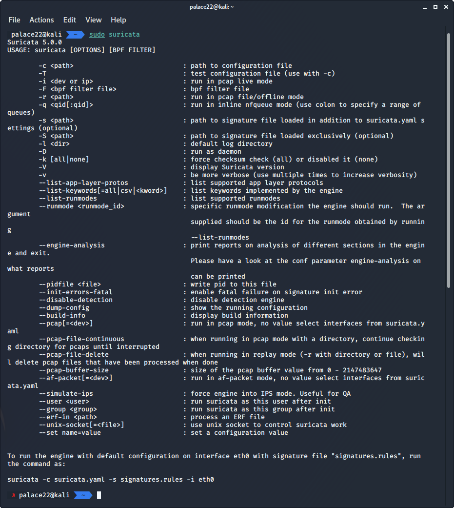
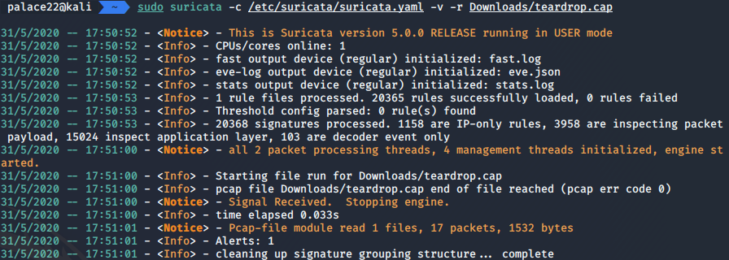

# Suricata

Suricata è un IDS open-source nato nel 2009, sviluppato dalla OISF ( Open Information Security Foundation ). 

Caratteristica peculiare di qesto IDS è che esegue le analisi in multithreadig, riuscendo a diminuire i consumi della CPU; il suo file di configuzaione è in *.yaml* ed è il competitor per eccellenza di *Snort*. 

Oltre ad essere un IDS è anche un IPS e NSM ( Network Security Monitoring ), oltre a notificare possibili attacchi può inviare notifiche attraverso la rete.


## Installazione

Per l'installazione su *Kali Linux*, basta seguire la guida della pagina ufficiale che riporta sia le dipendenze che i file e cartelle da creare. 




## Panoramica e configurazione
Dopo aver installato *Suricata* aprendo il file di configurazione si nota quanto è più intuitivo rispetto a quello di *Snort* grazie al formato *yaml*.
Ai fini del test configuriamo il tool come per Snort, settando rete da proteggere, output dei log e le regole.
Le principali differenze verranno analizzate nel confronto finale.


## Regole Suricata
Suricata chiama le proprie regole anche *signatures*. Il formato è come quello di Snort, è possibile infatti importare le propie regole Snort e utilizzare quelle della Community di **PulledPork**; inotre è di default la funzione 
```
sudo suricata-update
```
che aggiorna le regole. La documentazione è molto ampia e ben fatta, descrive come creare una regola e quali parametri scegliere a seconda del protocollo di comunicazione da osservare.

## Test
Settiamo il path di un nostro file *.rules* e testiamo.

```yml
default-rule-path: /var/lib/suricata/rules

rule-files:
  - suricata.rules
```

### Ping
Abbiamo visto come le regole si Snort sono supportate anche da Suritata dunque proviamo a settarne una e pingare i pacchetti *icmp*:

```
alert icmp any any -> $HOME_NET any (msg:"Qualcuno sta pingando!"; GID:1; sid:10000001; rev:001; classtype:icmp-event;)
```

Troveremo i log complett all'interno dei file in */var/log/suricata/*:

```json
{
    "timestamp": "2020-02-05T16:59:06.593199+0100",
    "flow_id": 1888256170528047,
    "in_iface": "eth0",
    "event_type": "alert",
    "src_ip": "192.168.1.85",
    "dest_ip": "192.168.1.176",
    "proto": "ICMP",
    "icmp_type": 8,
    "icmp_code": 0,
    "alert": {
        "action": "allowed",
        "gid": 1,
        "signature_id": 10000001,
        "rev": 1,
        "signature": "Qualcuno sta pingando!",
        "category": "Generic ICMP event",
        "severity": 3
    },
    "flow": {
        "pkts_toserver": 1,
        "pkts_toclient": 0,
        "bytes_toserver": 98,
        "bytes_toclient": 0,
        "start": "2020-02-05T16:59:06.593199+0100"
    }
}
```
### DoS
[Wiki Wireshark](https://wiki.wireshark.org/) fornisce una vasta gamma di file *.pcap* ( *public capture* ), ovvero file che contengono/catturano paccheti di rete. Servono ad analizzare e testate IDS e monitorare la rete. Scarichiamo *teardown.cap* e testiamo Suricata du un attacco di tipo Denial of Service:



In modo simile a Snort è stato lanciato il comando per avviare il DoS, *Suricata* ha rilevato l'attacco è ha lanciato un segnale di *Alert* che verrà salvato nel file dei log, questo contiene: 
```
[**] [1:270:6] DOS Teardrop attack [**]
[Classification: Attempted Denial of Service] [Priority: 2] 
09/09-06:11:26.616090 00:40:33:D9:7C:FD -> 00:00:39:CF:D9:CD type:0x800 len:0x46
10.1.1.1 -> 129.111.30.27 UDP TTL:64 TOS:0x0 ID:242 IpLen:20 DgmLen:56 MF
Frag Offset: 0x0000   Frag Size: 0x0024
[Xref => http://www.cert.org/advisories/CA-1997-28.html][Xref => http://cgi.nessus.org/plugins/dump.php3?id=10279][Xref => http://cve.mitre.org/cgi-bin/cvename.cgi?name=1999-0015][Xref => http://www.securityfocus.com/bid/124]

```


